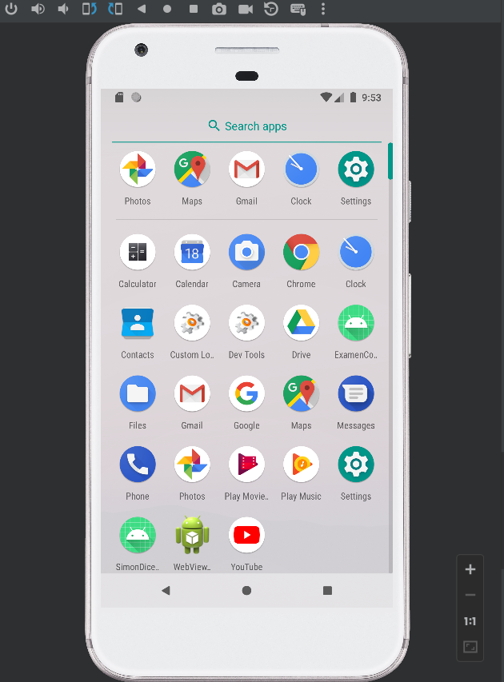
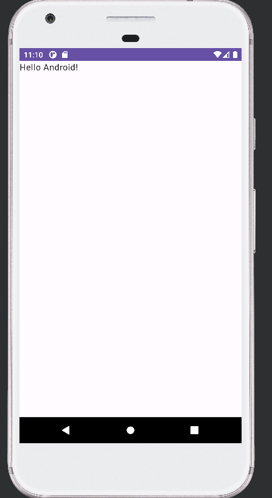
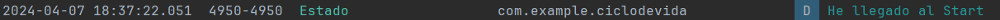
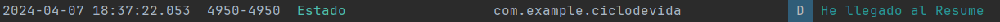
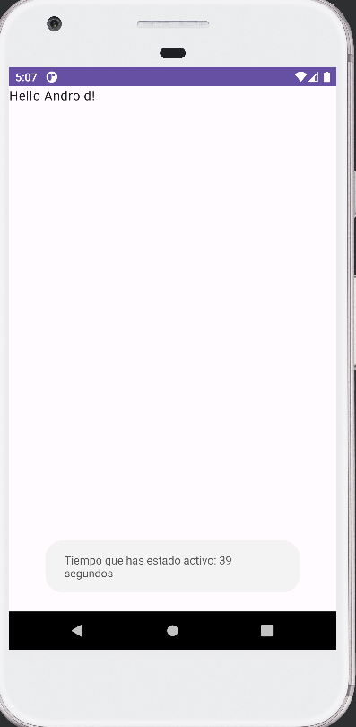
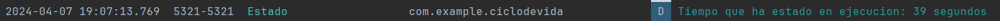

## Ciclo de Vida de una Activity - Aplicación de Registro de Tiempo de Actividad

Esta aplicación de Android registra los mensajes del ciclo de vida de una `Activity` en el Logcat y también imprime el
tiempo que la actividad ha estado activa cada vez que entra en pausa.

### Funcionalidades:

1. **Registro de Ciclo de Vida:** La aplicación registra mensajes en el Logcat para cada uno de los eventos del ciclo
   de vida de la `Activity`, como `onCreate()`, `onStart()`, `onResume()`, `onPause()`, `onStop()`, y `onDestroy()`.

- `onCreate()`
  Se llama cuando la actividad está siendo creada.

- `onStart()`
  Se llama cuando la actividad está a punto de hacerse visible, y es donde recoje el tiempo del pricipio de la actividad 
con `System.currentTimeMillis()` y tambien registra en el Logcat con `Log.d()` un mensaje esta línea para el logcat lo usaremos en todos los metodos.

- `onResume`
  Se llama cuando la actividad se vuelve interactiva y está en primer plano. También llama al metodo de `uptdateUI()` para que 
el usuario vea el tiempo transcurrido.

- `onPause()`
  Se llama cuando otra actividad está tomando el foco (esta actividad está a punto de ser pausada). Aquí es donde con
  `System.currentTimeMillis()` recojes el tiempo que ha estado funcionando la actividad y calculas el tiempo transcurrido

## Autor Miguel Mariño Martinez

