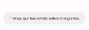

## Ciclo de Vida de una Activity - Aplicación de Registro de Tiempo de Actividad

Esta aplicación de Android registra los mensajes del ciclo de vida de una `Activity` en el Logcat y también imprime el
tiempo que la actividad ha estado activa cada vez que entra en pausa.

### Funcionalidades:

1. **Registro de Ciclo de Vida:** La aplicación registra mensajes en el Logcat para cada uno de los eventos del ciclo
   de vida de la `Activity`, como `onCreate()`, `onStart()`, `onResume()`, `onPause()`, `onStop()`, y `onDestroy()`.
- `onResume`

- `onPause()`

2. **Registro de Tiempo de Actividad:** Cada vez que la actividad entra en pausa, imprime en el Logcat el tiempo que
   estuvo activa desde que se creó.

## Autor Miguel Mariño Martinez

